# Reproducing Experiments from SubSet ML Papter
[Link to Paper](https://drive.google.com/file/d/1SEJ-7u5k0KuQnr2oVucuwBNe8bxYE2Yw/view)

### Models + Q Strategy implemented:
- Gaussian Processes (GP) + Uncertainity
- GP + Random

### Test Station Allocation:
- Random
- $D^{2}$
- Latin HyperCube Sampling

### Dataset
- **Beijing Dataset**
- 36 stations
- starting_timestamp: `2013-11-09 00:00:01`
- end_timestamp: `2013-11-20 00:00:01`

### Evaluation Criteria
- Root Mean Square (Lower is better)

## Active Learning Visualization
### Uncertainty Sampling (LHS placing of test_centers)
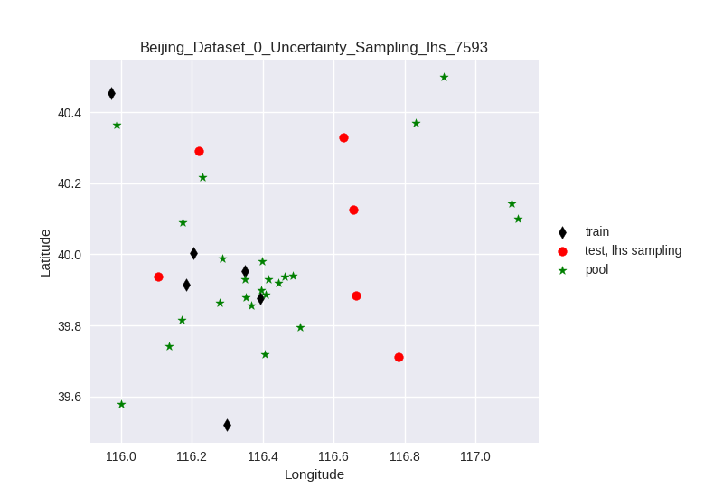
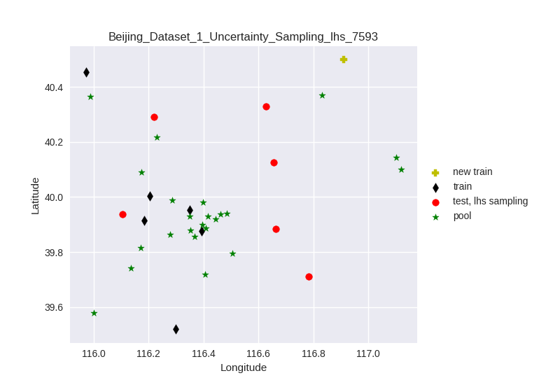
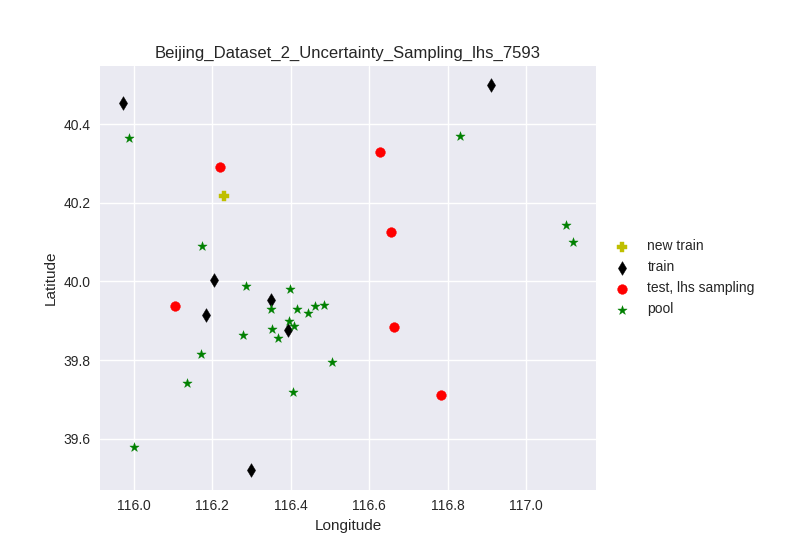
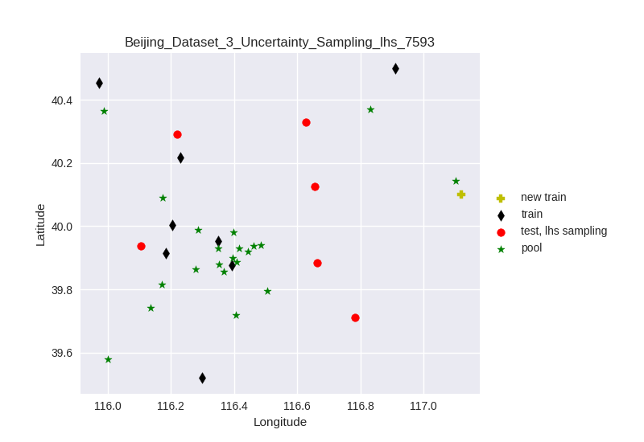
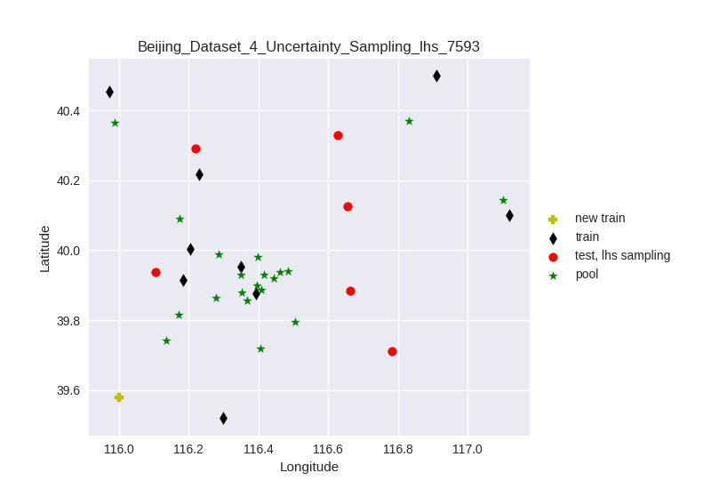
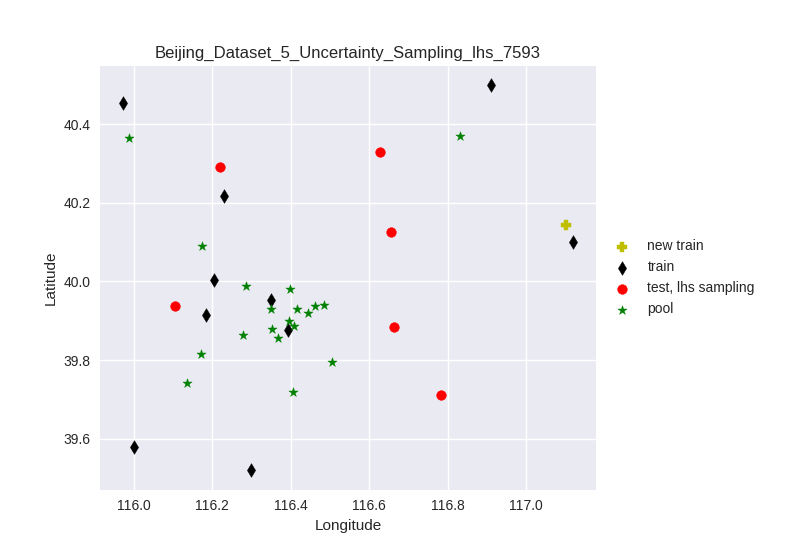
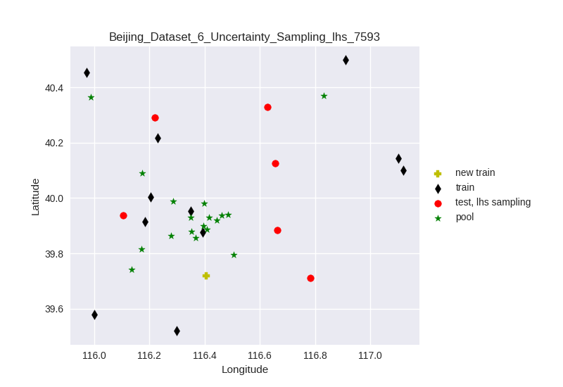
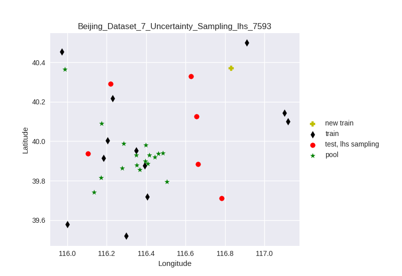
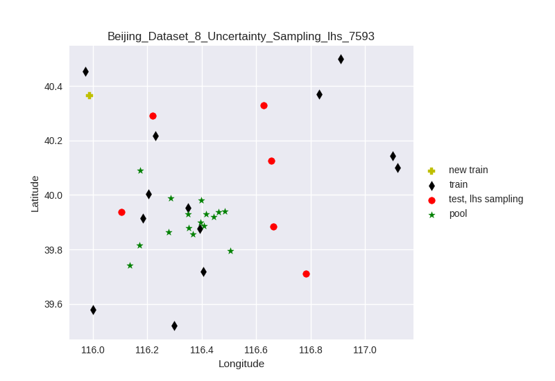

### Uncertainty Sampling (D2 placing of test_centers)
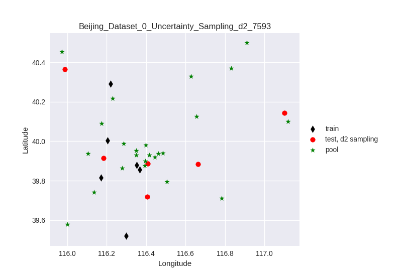
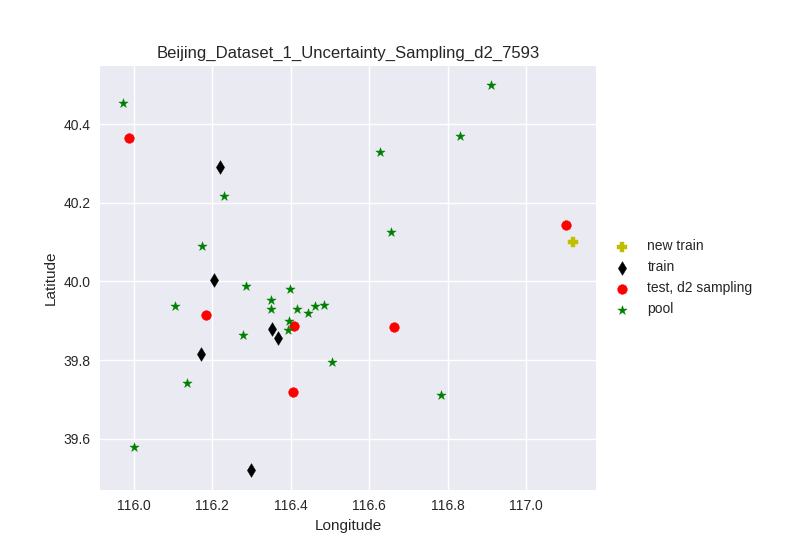
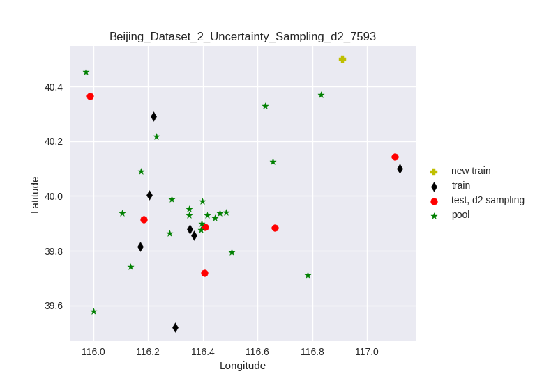

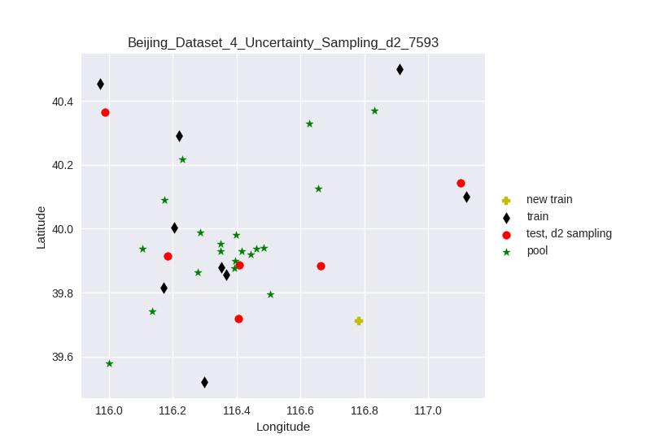
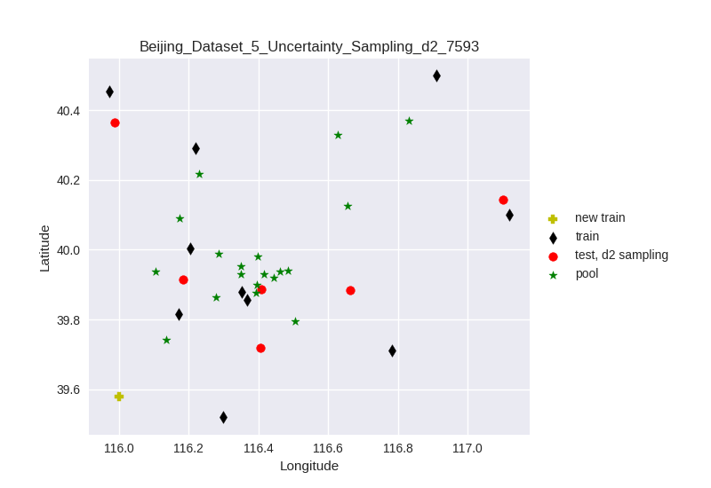
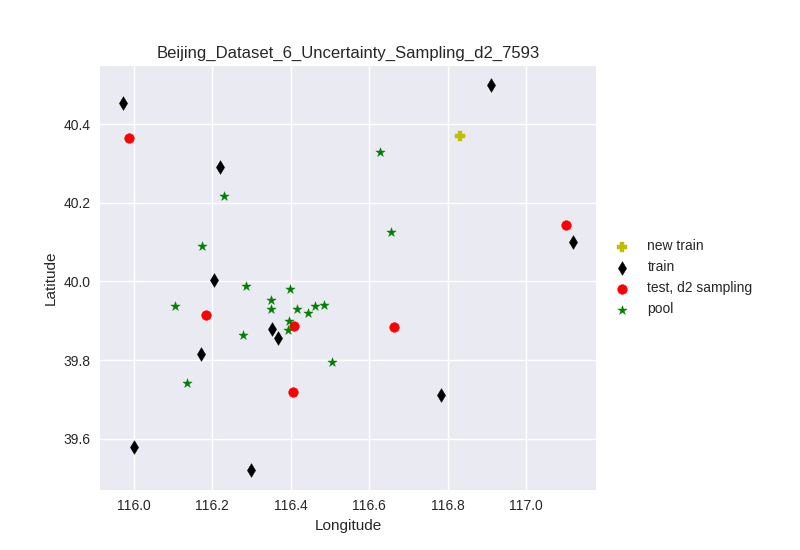

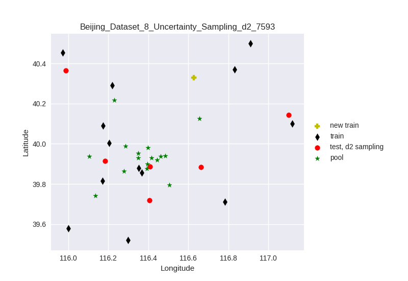
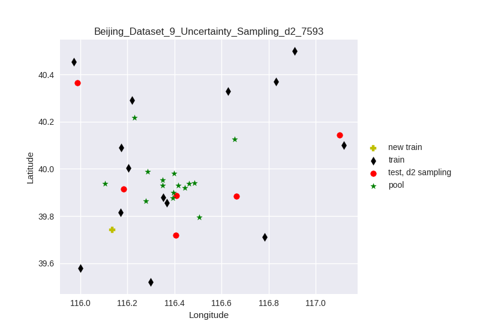
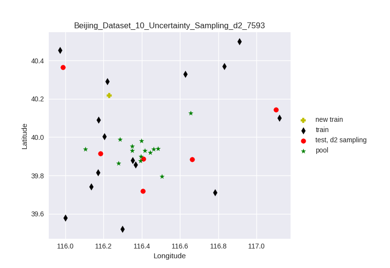

### Results
